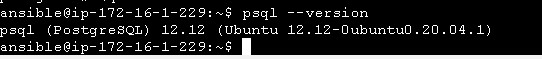
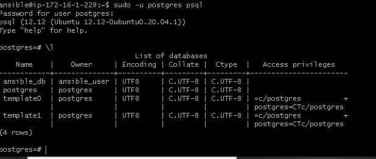

# Altschool Exam
## Deploy a laravel app with apache2 and mysql, and install and set up postgresql
To run the ansible playbook  
``` ansible-playbook main.yml --ask-vault-pass```  
Then enter the vault password.  

The domain name is [sarahligbe.live](https://sarahligbe.live).  

### Postgresql
`psql --version`  



#### List of users and databases in postgresql  


