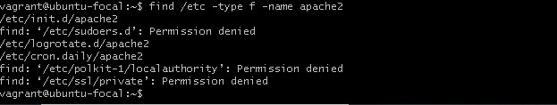
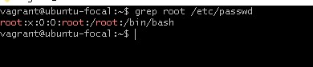
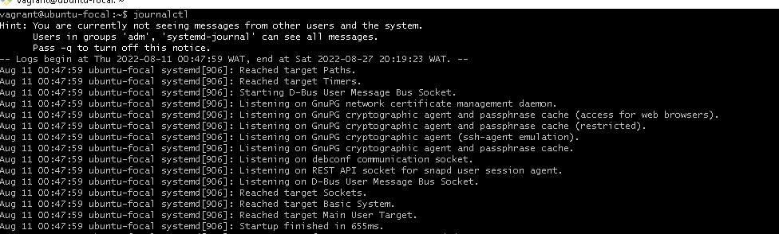
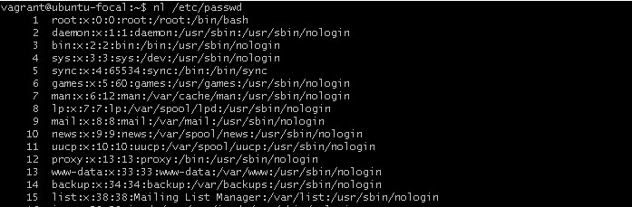
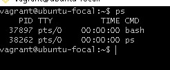
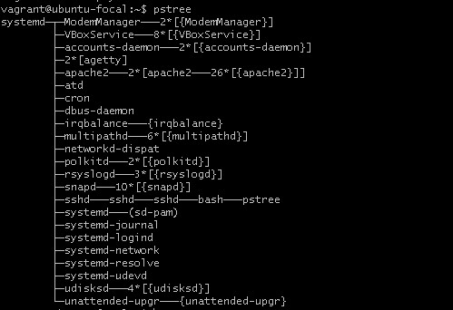
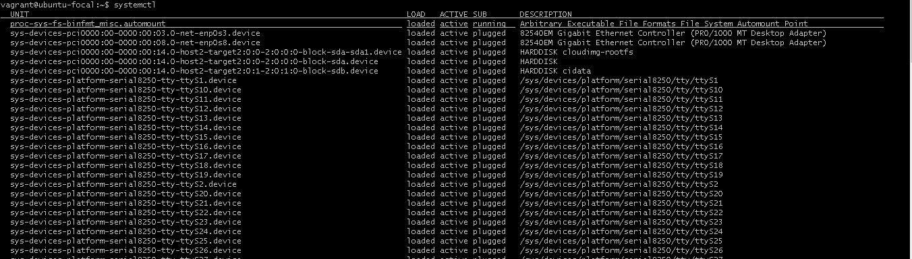
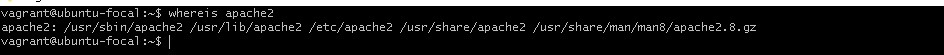
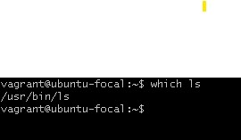

# Exercise 2
## 10 Linux commands
1. exit : this command is used to exit the shell where it is currently running.  
**usage**- _exit [N]_  (where n is the status of the shell)  

1. find : this command is used to search. it is capable of beginning your search in any designated directory and looks for a number of different parameters like the filename, date of creation or modification, owner, group, permissions, and size.  
**usage** - _find DIRECTORY OPTIONS PARAMETERS_  

1. grep : grep stands for global regular expression print. This command can be used to search a file for a particular pattern of characters, and displays lines that contain that pattern. grep is often used when output is piped from one command to another.  
**usage** - _grep [OPTIONS] PATTERN [FILENAME]  

1. journalctl : this command is used to display the record of journal logs of systemd and the kernel.  
**usage** - journalctl [OPTIONS] [MATCHES]  

1. nl : this command is used to display a file with line numbers.  
**usage** - _nl [OPTIONS] FILENAME_  

1. ps : ps stands for process status. This command is used to list all running processes and their PID(procrss ID), TTY (terminal device where the process is running), TIME (total amount of time the process has spent running instructions on the processor) and the COMMAND.  
**usage** - _ps [OPTIONS]_  

1. pstree : this command is used to display running processes as a tree.  
**usage** - _pstree [OPTIONS] [PID or USERNAME]_  

1. systemctl : this command is used to control and manage systemd(init process, it manages and starts up every other process in the linux machine) and services.  
**usage** - _systemctl [OPTIONS] COMMAND [UNITS]  
 
1. whereis : this command is used to find the location of the specified name of the binary files. The command returns the location of the binary file, its source and man pages if they are available.  
**usage** - _whereis [OPTIONS] [DIRECTORY] FILENAME_

1. which : this command is used to locate the executable(binary) file associated with a command by searching it in the path environment variable.  
**usage** - _which [-a] FILENAME_. (where -a is the option to print all amtching pathnames of the argument)  

**note**: _everything written in [ ] are optional commands_
