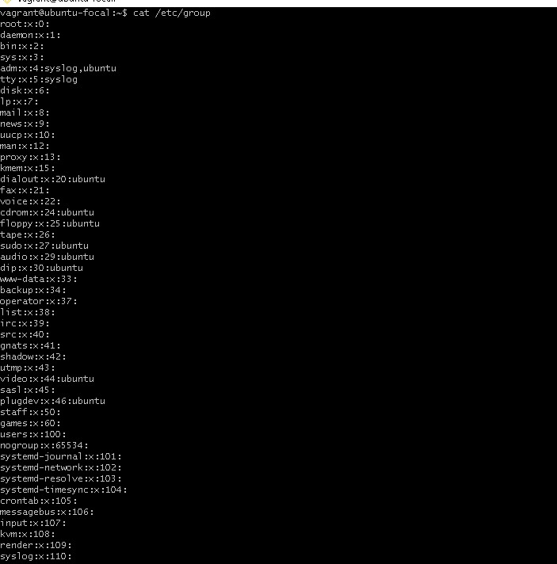
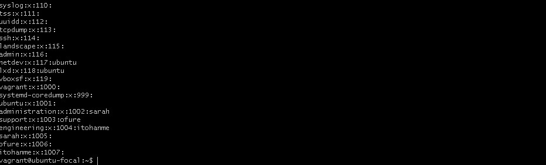
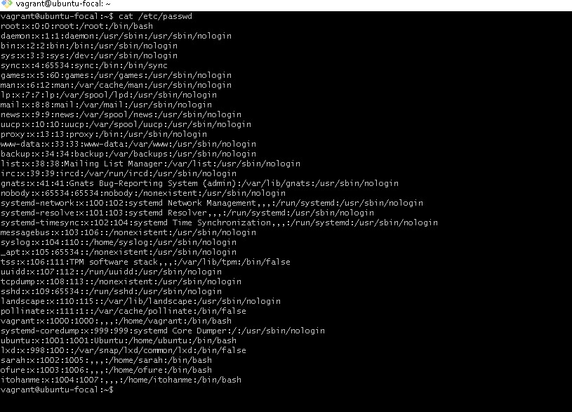
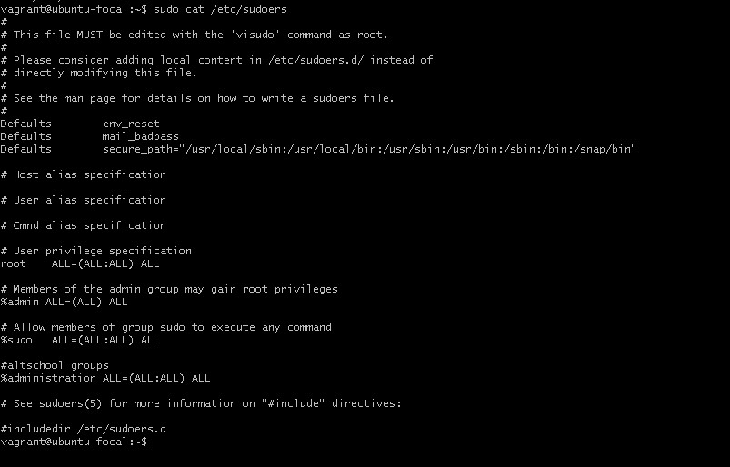

# Exercise 3
## Creating users and groups
We were asked to create three groups; admin, support and engineering but the admin group already exists by default so I created an administration group.
1. I created three groups using  
    ``` sudo groupadd administration```  
    ``` sudo groupadd support```  
    ``` sudo groupadd engineering```    
   The content of the /etc/group file is attached below  
     
     
2. I created users sarah, ofure and itohanme using  
   ``` sudo useradd -s /bin/bash -m sarah```  
   ``` sudo useradd -s /bin/bash -m ofure```  
   ``` sudo useradd -s /bin/bash -m itohanme```  
   and added them to the groups administration, support and engineering respectively using  
   ``` sudo usermod -aG administration sarah```  
   ``` sudo usermod -aG support ofure```  
   ``` sudo usermod -aG engineering itohanme```  
   The content of the /etc/passwd file is shown below  
     
3. I added the `administration` group to the sudoers file shown below  
     
4. I created ssh keys for the user in the administrative group by switching to that user using  
   ```su sarah``` and running the  
   ```ssh-keygen``` command.
