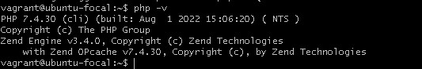
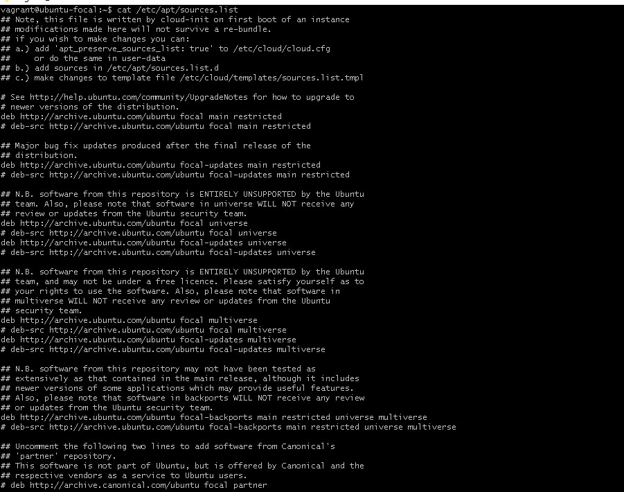

# Exercise 5
## Installing php7.4
I installed php7.4 using the following commands:
1. `sudo apt update` to ensure I have the latest versions of anything i want to install
2. `sudo apt -y install software-properties-common` to add management for additional software sources
3. `sudo add-apt-repository ppa:ondrej/php` to add the repository which gives me all the versions of php.
4. `sudo apt update` again so the package manager can see the newly listed packages
5. ` sudo apt -y install php7.4` to install php7.4. -y flag automatically agrees to the installation.
6. ` php -v` to see the php version. The output below:  
  
7. `cat /etc/sources.list` a configuration file for Linux's Advance Packaging Tool, that holds URLs and other information for remote repositories from where software packages and applications are installed.  
  