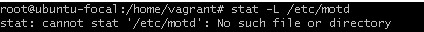

# Exercise 7
# CIS Benchmarks
### Ensure at least your system follows 10 CIS Benchmarks.  
1. Ensure permissions on /etc/motd are configured  
Description:  
The contents of the /etc/motd file are displayed to users after login and function as a message of the day for authenticated users.   
Rationale: 
If the /etc/motd file does not have the correct ownership it could be modified by unauthorized users with incorrect or misleading information.   
  
Default Value:  
The file does not exist.  
2. Ensure permissions on /etc/issue are configured  
Description:   
The contents of the /etc/issue file are displayed to users prior to login for local terminals.   
Rationale:   
If the /etc/issue file does not have the correct ownership it could be modified by unauthorized users with incorrect or misleading information.   
  
Default Value:   
Access: (0644/-rw-r--r--) Uid: ( 0/ root) Gid: ( 0/ root)   
3. Ensure access to the su command is restricted  
Description:   
The su command allows a user to run a command or shell as another user. The program has been superseded by sudo, which allows for more granular control over privileged access. Normally, the su command can be executed by any user. By adding, or uncommenting, the pam_wheel.so statement in /etc/pam.d/su , the su command will only allow users in a specific group to execute su. This group should be empty to reinforce the use of sudo for privileged access.   
Rationale:   
Restricting the use of su, and using sudo in its place, provides system administrators better control of the escalation of user privileges to execute privileged commands. The sudo utility also provides a better logging and audit mechanism, as it can log each command executed via sudo, whereas su can only record that a user executed the su program.  
  
4. Ensure journald is configured to send logs to rsyslog   
Description:   
Data from journald may be stored in volatile memory or persisted locally on the server. Utilities exist to accept remote export of journald logs, however, use of the rsyslog service provides a consistent means of log collection and export.  
Rationale:   
Storing log data on a remote host protects log integrity from local attacks. If an attacker gains root access on the local system, they could tamper with or remove log data that is stored on the local system.   
  
Default Value:  
ForwardToSyslog=yes  
5. Ensure journald is configured to compress large log files  
Description:   
The journald system includes the capability of compressing overly large files to avoid filling up the system with logs or making the logs unmanageably large.   
Note: The main configuration file /etc/systemd/journald.conf is read before any of the custom *.conf files. If there are custom configs present, they override the main configuration parameters   
Rationale:   
Uncompressed large files may unexpectedly fill a filesystem leading to resource unavailability. Compressing logs prior to write can prevent sudden, unexpected filesystem impacts.   
  
Default Value:  
Compress=yes  
6. Ensure ufw is installed  
Description:   
The Uncomplicated Firewall (ufw) is a frontend for iptables and is particularly well-suited for host-based firewalls. ufw provides a framework for managing netfilter, as well as a command-line interface for manipulating the firewall   
Rationale:   
A firewall utility is required to configure the Linux kernel's netfilter framework via the iptables or nftables back-end. 
The Linux kernel's netfilter framework host-based firewall can protect against threats originating from within a corporate network to include malicious mobile code and poorly configured software on a host.   
  
7. Ensure XD/NX support is enabled  
Description:   
Recent processors in the x86 family support the ability to prevent code execution on a per memory page basis. Generically and on AMD processors, this ability is called No Execute (NX), while on Intel processors it is called Execute Disable (XD). This ability can help prevent exploitation of buffer overflow vulnerabilities and should be activated whenever possible. Extra steps must be taken to ensure that this protection is enabled, particularly on 32-bit x86 systems. Other processors, such as Itanium and POWER, have included such support since inception and the standard kernel for those platforms supports the feature.   
Note: Ensure your system supports the XD or NX bit and has PAE support before implementing this recommendation as this may prevent it from booting if these are not supported by your hardware   
Rationale:   
Enabling any feature that can protect against buffer overflow attacks enhances the security of the system.  
  
8. Ensure AppArmor is installed  
Description:   
AppArmor provides Mandatory Access Controls.   
Rationale:   
Without a Mandatory Access Control system installed only the default Discretionary Access Control system will be available.   
  
9. Ensure /var/tmp partition includes the noexec option   
Description:   
The noexec mount option specifies that the filesystem cannot contain executable binaries.   
Rationale:   
Since the /var/tmp filesystem is only intended for temporary file storage, set this option to ensure that users cannot run executable binaries from /var/tmp .   
If a /var/tmp partition exists, verify that the noexec option is set.  
  
The partition does not exist.  
10. Ensure DNS Server is not installed  
Description:  
The Domain Name System (DNS) is a hierarchical naming system that maps names to IP addresses for computers, services and other resources connected to a network.  
Rationale:   
Unless a system is specifically designated to act as a DNS server, it is recommended that the package be deleted to reduce the potential attack surface.   
Audit:   
Run the following command to verify DNS server is not installed:   
  
 