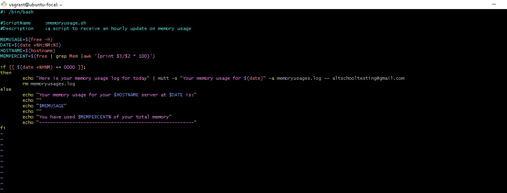

# Exercise 8
# Bash scripting and crontab
## A bash script was created to run every hour, save the system memory to a file and send an email containing the file at midnight. A screenshot of the script, cronjob, sample email is attached below.  
1. The script  
  
2. The cronjob  
  
3. The sample email received  

4. I took the liberty of attaching the screenshot of what the log file created from the script  
  