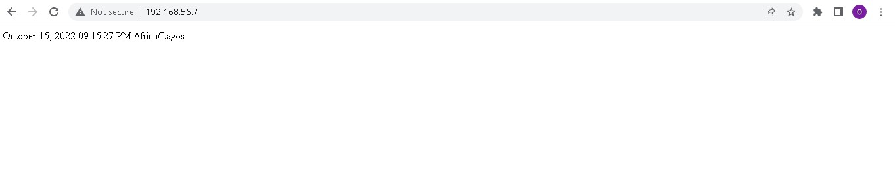

# Exercise 9
## Ansible
### An ansible playbook was created to install apache and php and render a php page
1. Install ansible on the control node   
`sudo add-apt-repository ppa:ansible/ansible`  
`sudo apt install ansible`  
2. create an ssh key on the control node  
`ssh-keygen`  
3. copy the public key from the control node to the managed node(the remote system where apache and php will be installed)  
`ssh-copy-id vagrant@192.168.56.7`  
4. An ansible directory was created. a host_inventory file was created and the remote machine's IP address was added.
5. An ansible.cfg was also created which pointed to the host_inventory file
6. The ansible playbook 'playbook.yml' was created and the tasks were written inside.  
7. `ansible-playbook playbook.yml` was run to execute the tasks.  
8. Attached below is a photo of the rendered page.  
  