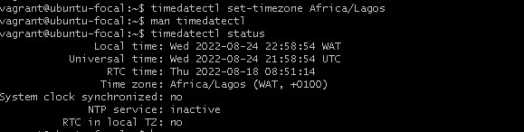

#Timezone exercise
##Changing the timezone of the linux system
To change the timezone of the linux system, `timedatectl` command was used
1. Start your VM using `vagrant up`
2. SSH into your VM using `vagrant ssh`
3. Get the list of the available timezones using `timedatectl list-timezones`
4. Set your prefered timezone (Africa/Lagos) in my case using `timedatectl set-timezone Africa/Lagos`
5. Check your timezone status using `timedatectl status`. Your output should like this:

